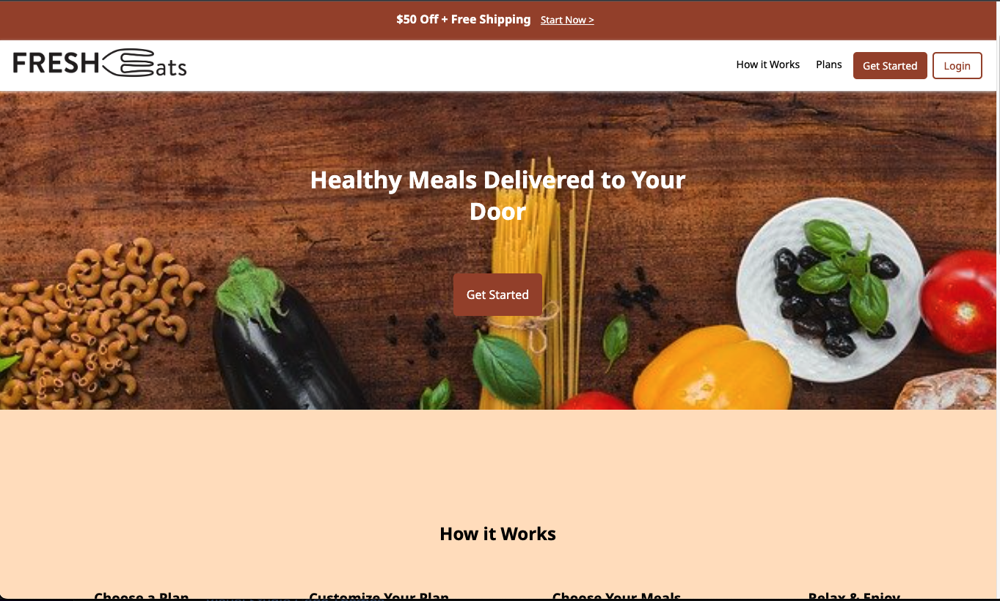

# nancy-fresheats
A mobile-first one-page layout for a fictional meal delivery service website. I researched similar meal delivery services in order to design this website. The logo and images were provided by the fictional client. the layout was mostly done with flexbox, which also ensured responsiveness. The clickable hamburger menu was made using CSS only.

